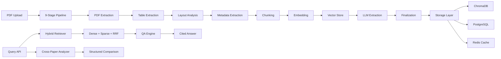

# Intelligent Document Processing Platform


An end-to-end document processing platform that ingests research papers (PDF), extracts structured information using LLMs, enables semantic search and question answering with citation tracking, and provides cross-paper comparison capabilities. Built as a production-ready system with multi-stage Docker builds, CI/CD pipelines, and GCP Cloud Run deployment.

## Architecture



## Key Features

**Document Ingestion (Phase 1)**
- PDF text extraction with native + OCR fallback (PyMuPDF + Tesseract)
- Table extraction via pdfplumber with confidence scoring
- Layout analysis detecting 12 section types (title, abstract, methodology, etc.)
- Metadata extraction (authors, DOI, journal, keywords)

**Chunking & Embedding (Phase 2)**
- Section-aware chunking that respects document structure
- Token-based splitting with configurable overlap
- Enriched chunks with provenance metadata (section type, page numbers)

**Retrieval & Search (Phase 3)**
- Hybrid dense + sparse retrieval with Reciprocal Rank Fusion (RRF)
- Dense: ChromaDB vector store with Gemini embeddings
- Sparse: BM25 index for keyword matching
- Configurable alpha weighting between dense and sparse signals

**LLM Intelligence (Phase 4)**
- Dual-prompt extraction with consistency scoring for key findings
- Citation-tracked QA with claim verification and faithfulness scoring
- Multi-level summarization (one-line, abstract, detailed map-reduce)
- Hallucination detection via source grounding checks

**Full API & Real-time Updates (Phase 5)**
- 15+ RESTful endpoints for document lifecycle management
- WebSocket support for real-time processing updates
- Rate limiting, API key authentication, and CORS support
- Feedback loop for extraction quality improvement

**Evaluation Framework (Phase 6)**
- LLM-as-Judge evaluation for faithfulness, relevance, and completeness
- Automated benchmarks for extraction, retrieval (MRR, nDCG), and QA
- ROUGE-based summarization evaluation
- CI quality gate that fails builds below thresholds

**Docker & Deployment (Phase 7)**
- Multi-stage Docker build (builder + runtime, non-root user)
- Production docker-compose with health checks and resource limits
- GitHub Actions CI/CD with lint, type-check, test, build, deploy stages
- GCP Cloud Run deployment script with scale-to-zero

**Advanced Features (Phase 8)**
- Task-based model routing (flash for simple, pro for complex)
- Multi-tier LLM response caching (Redis L1 + in-memory L2)
- Graceful degradation with component-specific fallback strategies
- Cross-paper structured comparison with agreement/contradiction detection

## Tech Stack

| Category | Technologies |
|----------|-------------|
| **Backend** | FastAPI, Pydantic v2, Uvicorn, Celery |
| **LLM** | Google Gemini (2.0-flash, 1.5-pro), Model Router |
| **Storage** | PostgreSQL, Redis, ChromaDB |
| **Processing** | PyMuPDF, pdfplumber, Tesseract OCR, Pillow |
| **Infrastructure** | Docker, docker-compose, GitHub Actions, GCP Cloud Run |
| **Testing** | pytest (458 tests), pytest-asyncio, httpx, pytest-cov |
| **Quality** | ruff (linting), mypy (type checking), ROUGE scoring |

## Quick Start

```bash
# Clone
git clone https://github.com/divya/intelligent-doc.git
cd intelligent-doc

# Install
python -m venv .venv && source .venv/bin/activate
pip install -e ".[dev]"

# Configure
cp .env.example .env
# Edit .env with your GEMINI_API_KEY

# Run
uvicorn src.main:app --reload --port 8000

# Or with Docker
docker compose -f docker-compose.prod.yml up -d
```

## API Endpoints

| Method | Endpoint | Description |
|--------|----------|-------------|
| `POST` | `/api/v1/documents/upload` | Upload a PDF for processing |
| `GET` | `/api/v1/documents/{id}` | Get document details and extracted data |
| `GET` | `/api/v1/documents` | List all documents with pagination |
| `GET` | `/api/v1/documents/{id}/status` | Get processing status |
| `DELETE` | `/api/v1/documents/{id}` | Delete a document |
| `POST` | `/api/v1/query` | Ask a question about papers (cited QA) |
| `POST` | `/api/v1/search` | Semantic search across papers |
| `POST` | `/api/v1/compare` | Compare multiple papers |
| `GET` | `/api/v1/documents/{id}/summary/{level}` | Generate paper summary |
| `POST` | `/api/v1/documents/{id}/re-extract` | Re-run extraction |
| `POST` | `/api/v1/feedback` | Submit extraction feedback |
| `GET` | `/api/v1/admin/health` | Health check (all services) |
| `GET` | `/api/v1/admin/metrics` | System usage metrics |
| `GET` | `/api/v1/admin/costs` | LLM cost breakdown |
| `GET` | `/api/v1/admin/evaluation` | Latest evaluation results |

## Project Structure

```
src/
├── main.py                  # FastAPI app with lifespan
├── config.py                # Pydantic settings (env-based)
├── api/
│   ├── auth.py              # API key authentication
│   ├── rate_limiter.py      # SlowAPI rate limiting
│   ├── routes_admin.py      # Health, metrics, costs endpoints
│   ├── routes_documents.py  # Document CRUD endpoints
│   ├── routes_extract.py    # Extraction management endpoints
│   ├── routes_query.py      # Query, search, compare, summary
│   ├── stores.py            # In-memory document store
│   └── websocket.py         # WebSocket processing updates
├── ingestion/
│   ├── pdf_parser.py        # PDF text extraction (native + OCR)
│   ├── table_extractor.py   # Table extraction via pdfplumber
│   ├── layout_analyzer.py   # Section detection (12 types)
│   └── metadata_extractor.py # Title, authors, DOI extraction
├── chunking/
│   ├── chunker.py           # Section-aware token chunking
│   └── chunk_optimizer.py   # Chunk quality optimization
├── retrieval/
│   ├── vector_store.py      # ChromaDB wrapper
│   ├── embedding_service.py # Gemini embedding generation
│   ├── bm25_index.py        # Sparse BM25 index
│   ├── hybrid_retriever.py  # Dense + sparse + RRF fusion
│   ├── reranker.py          # Result reranking
│   └── query_processor.py   # Query expansion & processing
├── llm/
│   ├── gemini_client.py     # Centralized LLM client with caching
│   ├── model_router.py      # Task-based model selection
│   ├── cache_manager.py     # Multi-tier response caching
│   ├── degradation.py       # Graceful fallback strategies
│   ├── extractor.py         # Dual-prompt finding extraction
│   ├── qa_engine.py         # Citation-tracked QA
│   ├── summarizer.py        # Multi-level summarization
│   ├── cross_paper.py       # Cross-paper comparison
│   └── prompts.py           # All prompt templates
├── evaluation/
│   ├── benchmarks.py        # Automated benchmark suite
│   ├── extraction_eval.py   # Extraction quality metrics
│   ├── qa_eval.py           # QA faithfulness evaluation
│   └── retrieval_eval.py    # Retrieval MRR/nDCG metrics
├── monitoring/
│   ├── cost_tracker.py      # LLM cost tracking
│   └── metrics.py           # Prometheus metrics
├── models/
│   ├── schemas.py           # 35+ Pydantic schemas
│   └── database.py          # SQLAlchemy models
└── workers/
    ├── celery_app.py        # Celery configuration
    └── tasks.py             # 9-stage processing pipeline
```

## Testing

```bash
# Run all unit tests
python -m pytest tests/unit/ -v

# Run with coverage
python -m pytest tests/unit/ --cov=src --cov-report=term-missing

# Run integration tests
python -m pytest tests/integration/ -v

# Run specific test module
python -m pytest tests/unit/test_cross_paper.py -v
```

**Test Coverage:** 449 unit tests + 9 integration tests across 29 test files covering all 8 phases.

## Deployment

### Docker

```bash
# Build
docker build -t research-processor .

# Run with production compose
docker compose -f docker-compose.prod.yml up -d
```

### GCP Cloud Run

```bash
# One-command deployment
bash scripts/deploy_gcp.sh
```

See [docs/PHASE7_WALKTHROUGH.md](docs/PHASE7_WALKTHROUGH.md) for detailed deployment guide.

## Design Decisions

| Decision | Rationale |
|----------|-----------|
| **Hybrid Retrieval (Dense + Sparse + RRF)** | Dense embeddings capture semantic meaning while BM25 handles exact keyword matches. RRF fusion combines both without requiring score normalization. |
| **Dual-Prompt Extraction** | Running two differently-worded prompts and computing consistency scores catches hallucinated findings. Low agreement flags papers for human review. |
| **Task-Based Model Routing** | Simple tasks (extraction, QA) use the fast/cheap model while complex tasks (comparison, evaluation) route to the pro model. Reduces cost by ~80% with minimal quality impact. |
| **Graceful Degradation** | When Redis/vector store/DB is down, the system returns safe fallback values instead of 500 errors. Keeps the API functional during partial outages. |
| **In-Memory Document Store** | Avoids PostgreSQL dependency for development. The interface is designed to swap to a DB-backed implementation with zero API changes. |

## License

MIT
