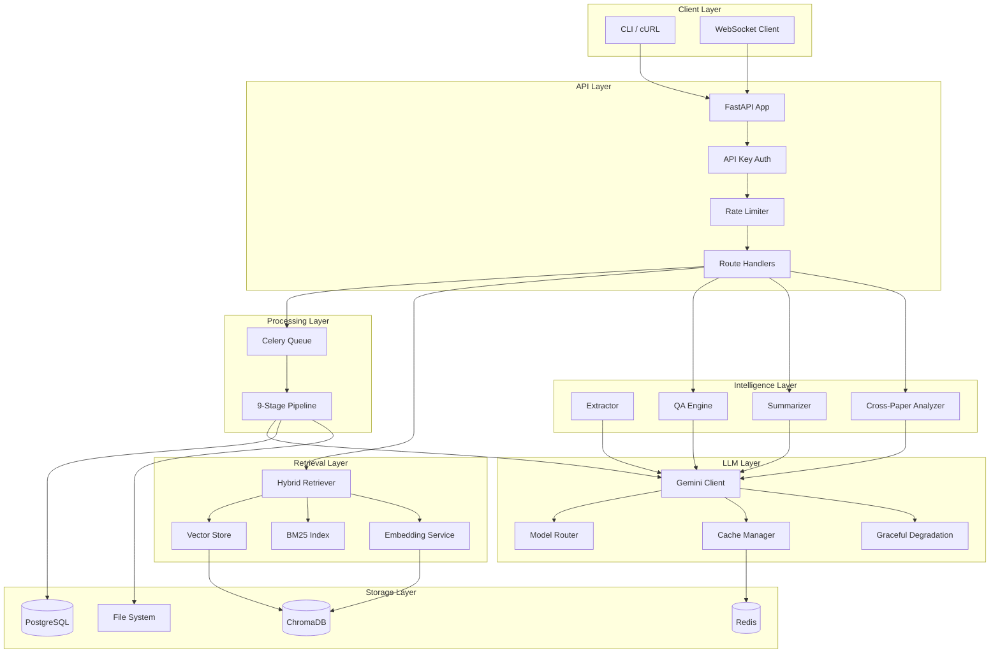
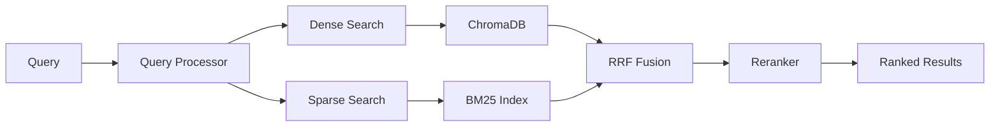

# Architecture Documentation

## System Overview



## Component Architecture

### API Layer (`src/api/`)

The API layer is built on FastAPI with four route modules:

- **routes_documents.py** — Document CRUD (upload, list, detail, delete, status)
- **routes_query.py** — Query, search, compare, and summary endpoints
- **routes_extract.py** — Re-extraction and feedback management
- **routes_admin.py** — Health checks, metrics, costs, evaluation results

All LLM-backed services use lazy initialization to avoid import-time failures:

```python
_qa_engine = None

def _get_qa_engine():
    global _qa_engine
    if _qa_engine is None:
        from src.llm.qa_engine import QAEngine
        _qa_engine = QAEngine(client=_get_client(), retriever=_get_retriever())
    return _qa_engine
```

**Authentication:** API key verification via `X-API-Key` header. Optional for health endpoint.

**Rate Limiting:** SlowAPI with per-endpoint limits (query: 10/min, admin: 30/min).

**In-Memory Store:** `InMemoryDocumentStore` provides a dict-backed document store with thread-safe operations. Designed for swappable PostgreSQL backend.

### Processing Layer (`src/workers/`)

Documents go through a 9-stage Celery pipeline:

| Stage | Component | Description |
|-------|-----------|-------------|
| 1 | `pdf_parser.py` | Extract text from each page (native text → OCR fallback) |
| 2 | `table_extractor.py` | Extract tables via pdfplumber |
| 3 | `layout_analyzer.py` | Detect section boundaries (12 types) |
| 4 | `metadata_extractor.py` | Extract title, authors, DOI, abstract |
| 5 | `chunker.py` | Section-aware token-based chunking |
| 6 | `embedding_service.py` | Generate Gemini embeddings |
| 7 | `vector_store.py` | Store embeddings in ChromaDB |
| 8 | `extractor.py` | LLM-based finding/methodology/result extraction |
| 9 | Finalization | Update document status to completed |

Each stage updates processing status via WebSocket for real-time UI feedback.

### LLM Layer (`src/llm/`)

#### Gemini Client (`gemini_client.py`)

Centralized LLM interface with:
- **Redis caching:** SHA-256 cache keys from model + prompt + instruction
- **Retry logic:** Exponential backoff (1s, 2s, 4s) on 429/500/503
- **Prometheus metrics:** Request counts, token usage, latency histograms
- **Cost tracking:** Per-call USD cost computation

Two generation methods:
- `generate()` — Direct call with the configured model
- `generate_for_task()` — Routes to optimal model via ModelRouter, uses CacheManager

#### Model Router (`model_router.py`)

Routes tasks to cost-optimal models:

```
extraction    → gemini-2.0-flash  ($0.075/1M input)
qa            → gemini-2.0-flash
summarization → gemini-2.0-flash
comparison    → gemini-1.5-pro    ($1.25/1M input)
evaluation    → gemini-1.5-pro
```

Overrides allow runtime model swapping for A/B testing or cost optimization.

#### Cache Manager (`cache_manager.py`)

Two-tier caching with task-aware TTLs:

| Task Type | TTL | Rationale |
|-----------|-----|-----------|
| extraction | 7200s (2h) | Stable — same paper always produces same extraction |
| summarization | 3600s (1h) | Stable — summaries don't change |
| qa | 1800s (30m) | Semi-dynamic — new papers may change answers |
| comparison | 1800s (30m) | Semi-dynamic — depends on paper set |

- **L1 (Redis):** Shared, persistent, survives restarts
- **L2 (In-memory):** Fast local fallback when Redis is unavailable

#### Graceful Degradation (`degradation.py`)

Wraps component calls with fallback strategies:

```python
result = degradation.wrap(
    ComponentType.REDIS,
    lambda: redis.get(key),
    fallback=None,  # Return None if Redis is down
)
```

Tracks per-component failure counts for health monitoring. Components: LLM, Redis, Vector Store, Database.

#### Extraction (`extractor.py`)

Dual-prompt extraction pipeline:
1. Run `EXTRACT_KEY_FINDINGS` prompt → parse findings
2. Run `EXTRACT_KEY_FINDINGS_ALT` prompt → parse findings
3. Compute consistency score between the two sets
4. Confidence = 0.4 * consistency + 0.4 * grounding + 0.2 * completeness
5. Flag for review if confidence < 0.6

#### QA Engine (`qa_engine.py`)

Citation-tracked question answering:
1. Retrieve top-K passages via HybridRetriever
2. Build numbered context with [N] source labels
3. Generate answer with citation requirements
4. Verify each claim against cited sources
5. Compute faithfulness score

#### Cross-Paper Analyzer (`cross_paper.py`)

Structured comparison:
1. Gather context from document store for each paper
2. Format into comparison prompt with paper labels
3. Generate structured JSON comparison via LLM
4. Parse into comparison table, agreements, contradictions, synthesis

### Retrieval Layer (`src/retrieval/`)



#### Hybrid Retrieval with RRF

**Dense path:** Query → Gemini embedding → ChromaDB cosine similarity → top-K results

**Sparse path:** Query → BM25 scoring against all indexed chunks → top-K results

**Fusion:** Reciprocal Rank Fusion combines both:
```
RRF(d) = 1/(k + rank_dense(d)) + 1/(k + rank_sparse(d))
```
where k=60 (standard constant). No score normalization needed.

**Alpha weighting:** Controls dense vs sparse balance (default 0.5, configurable per query).

### Evaluation Framework (`src/evaluation/`)

#### LLM-as-Judge (`qa_eval.py`)

Evaluates QA quality on three dimensions:
- **Faithfulness:** Is every claim in the answer grounded in retrieved context?
- **Relevance:** Does the answer address the question asked?
- **Completeness:** Does the answer cover all relevant information?

#### Retrieval Metrics (`retrieval_eval.py`)

- **MRR (Mean Reciprocal Rank):** Average of 1/rank for the first relevant result
- **nDCG (Normalized Discounted Cumulative Gain):** Position-weighted relevance scoring
- **Recall@K:** Fraction of relevant documents in top-K results

#### Extraction Evaluation (`extraction_eval.py`)

- Confidence score distribution across extracted findings
- Consistency between dual-prompt extractions
- Review flag rate (papers flagged for human review)

### Monitoring (`src/monitoring/`)

- **Prometheus metrics:** Request counts, token usage, latency histograms (per model)
- **Cost tracking:** Per-model and per-endpoint USD cost breakdown
- **Health checks:** Database, Redis, ChromaDB connectivity status

## Data Flow

### Document Processing Pipeline

```
1. User uploads PDF via POST /api/v1/documents/upload
2. File saved to disk, DocumentRecord created (status: pending)
3. Celery task queued for async processing
4. Pipeline stages 1-9 execute sequentially:
   - PDF → pages → tables → sections → metadata → chunks → embeddings → vectors → extraction
5. Each stage updates status via WebSocket
6. On completion: status → completed, all data stored
7. User can now query, search, compare, or summarize
```

### Query Pipeline

```
1. User sends question via POST /api/v1/query
2. HybridRetriever finds top-K relevant passages
3. QA Engine builds numbered context from passages
4. Gemini generates answer with [N] citations
5. Verification step checks each claim against sources
6. Faithfulness score computed, flagged claims identified
7. Full QAResponse returned with citations and verification
```

## Deployment Architecture

### Docker Compose (Production)

```
┌─────────────────────────────────────────────┐
│              docker-compose.prod.yml         │
│                                              │
│  ┌─────────┐  ┌────────────┐  ┌──────────┐ │
│  │   app   │  │   celery   │  │ postgres │ │
│  │ :8000   │  │   worker   │  │  :5432   │ │
│  │ 2GB mem │  │  2 workers │  │  16 pg   │ │
│  └────┬────┘  └─────┬──────┘  └────┬─────┘ │
│       │              │              │        │
│       └──────┬───────┘              │        │
│              │                      │        │
│         ┌────┴────┐                 │        │
│         │  redis  │                 │        │
│         │  :6379  │                 │        │
│         │ 256MB   │                 │        │
│         └─────────┘                 │        │
│                                              │
│  Volumes: postgres_data, redis_data,         │
│           upload_data, chroma_data           │
└─────────────────────────────────────────────┘
```

### GCP Cloud Run

```
┌──────────────┐     ┌─────────────────┐
│  Cloud Run   │────▶│  Artifact       │
│  (app)       │     │  Registry       │
│  scale-to-0  │     │  (Docker image) │
└──────┬───────┘     └─────────────────┘
       │
       ├──▶ Cloud SQL (PostgreSQL, db-f1-micro)
       ├──▶ Memorystore Redis (basic, 1GB)
       └──▶ Secret Manager (API keys, DB URL)
```

**Cost optimization:**
- Cloud Run: Scale-to-zero, pay only for active requests
- Cloud SQL: db-f1-micro ($7/month)
- Memorystore: basic tier, 1GB
- Gemini Flash: $0.075/1M input tokens (80% of calls)
- Estimated monthly cost: $15-30 for light usage
